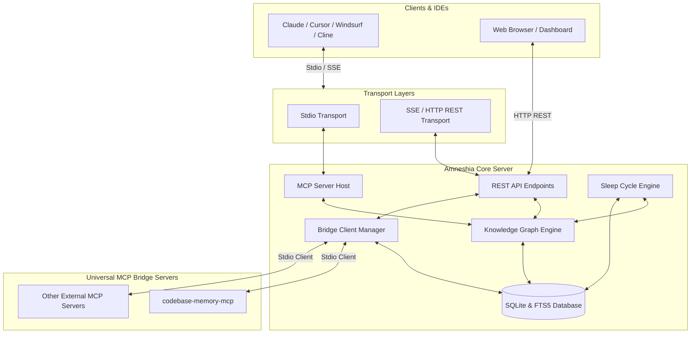

# 🧠 Amneshia

[](https://github.com/SabilMurti/Amneshia/releases)
[](LICENSE)
[](https://github.com/SabilMurti/Amneshia/actions)
[](https://github.com/SabilMurti/Amneshia/actions)

Unified, zero-external-database, multi-agent long-term memory hub. Built on top of **SQLite FTS5 + BM25 Search**, incorporating a **Universal MCP Bridge Manager**, a local **Sleep Cycle Memory Consolidation Engine**, and an interactive **TasteSkill Web Dashboard**.

---

## Architecture Diagram

Amneshia coordinates Stdio and SSE/HTTP transports, managing underlying storage, background consolidation tasks, and MCP integrations:



---

## Key Features

- **Semantic Knowledge Graph** — Not a simple, flat key-value store. Entities are organized using structured, typed relationships and observations.
- **FTS5 BM25 Search** — Integrates SQLite FTS5 extension with BM25 ranking for fast, typo-tolerant full-text query lookup.
- **Universal MCP Bridge** — Interoperability with external MCP servers (such as `codebase-memory-mcp`) allowing synchronization of external facts and tools dynamically.
- **Sleep Cycle Memory Consolidation** — Evaluates similarity metrics (Jaccard Similarity $\ge 0.8$) and LLM context analysis during sleep/idle states to deduplicate memories, resolve conflicts, track update histories, and purge expired ephemeral data.
- **Access Control Whitelisting** — Visibility properties (`public`, `restricted`, `private`) and whitelisting arrays (`allowedAgents`) prevent unauthorized agent access.
- **TasteSkill Web Dashboard** — Rich visual interface for exploring graphs, managing target exports, controlling bridge servers, and viewing memory statistics.

---

## Quick Start

### 1. Direct Run via GitHub (Zero NPM publish needed)

You can run Amneshia instantly from GitHub without installing anything:

```bash
# Run HTTP Web Dashboard & REST API
npx -y github:SabilMurti/Amneshia --http --port 3457
```

Or install globally via GitHub:

```bash
npm install -g github:SabilMurti/Amneshia

# Then run anywhere:
amneshia --http --port 3457
```

### 2. Stdio Mode (Standard IDE Integration)

To connect Amneshia to your editor/agent environment (e.g., Cursor, Antigravity IDE, Claude Code), add the server entry in your MCP config (`mcp_config.json`):

```json
{
  "mcpServers": {
    "amneshia": {
      "command": "npx",
      "args": ["-y", "github:SabilMurti/Amneshia"]
    }
  }
}
```

---

## Complete MCP Tools Reference (18 Tools)

Amneshia exposes 18 specialized tools to client agents for managing the memory cycle, querying data, and bridging other servers:

| Category | Tool Name | Parameters | Description |
| :--- | :--- | :--- | :--- |
| **Entity** | `create_entities` | `entities` (array of Entity Inputs) | Creates new unique entities with type, domain, and access whitelists. |
| | `delete_entities` | `names` (string array of names) | Removes entities and cascades deletes to their observations and relations. |
| **Relation** | `create_relations` | `relations` (array of Relation Inputs) | Establishes typed connections (e.g., `creator_of`, `works_on`) between entities. |
| | `delete_relations` | `ids` (string array of relation IDs) | Deletes specified relations by ID. |
| **Observation** | `add_observations` | `observations` (array of Obs Inputs) | Attaches raw observations or LLM-synthesized facts to an entity. |
| | `delete_observations`| `ids` (string array of observation IDs) | Deletes specified observations. |
| | `update_observation` | `id` (string), `content` (string), `changedBy`? | Updates observation content while logging the change history. |
| **Query & Graph**| `search_memory` | `query` (string), `limit`? | Performs FTS5 BM25 search across entity names, types, and observations. |
| | `read_graph` | `domain`?, `entityType`? | Retreives the full or filtered knowledge graph snapshot. |
| | `open_nodes` | `names` (string array) | Retrieves full attributes, observations, and relations of specific nodes. |
| **Lifecycle** | `cleanup_expired` | *None* | Deletes ephemeral observations that have passed their expiration date. |
| | `consolidate_memory`| `domain`? | Performs conflict resolution, near-duplicate Jaccard pruning, and synthesis. |
| | `get_stats` | *None* | Returns storage metrics, entity domain breakdowns, and recent activity logs. |
| **Exporter** | `export_memory` | *None* | Exports current graph snapshot to active Markdown targets. |
| | `manage_export_targets`| `action`, `name`?, `path`?, `format`?, `id`?, `autoExport`? | Registers, removes, or toggles auto-export Markdown paths. |
| | `configure_ai` | `provider` (string) | Changes default AI synthesis provider (`none`, `ollama`, `openai`). |
| **Universal Bridge**| `manage_bridge_servers`| `action` (string), `name`?, `command`?, `args`?, `id`? | Adds, lists, or removes downstream bridged MCP servers in SQLite. |
| | `list_bridge_tools` | `serverId` (string), `command`?, `args`? | Queries a bridged server to retrieve its exposed tools. |
| | `call_bridge_tool` | `serverId` (string), `toolName` (string), `arguments`? | Executes a tool on a bridged server and returns the result. |

---

## Web Dashboard & Codebase Integration

Amneshia serves a web client on `http://localhost:3457` when running in HTTP mode. The client provides:
1. **Interactive Graph Visualizer** for looking at entity links and node clusters.
2. **Bridge Manager** to register downstream MCP servers (e.g. `codebase-memory-mcp`) and configure commands/args.
3. **Settings Controls** to switch LLM Providers (Ollama, OpenAI, or None) and manage auto-export markdown logs.

### Codebase Memory MCP Bridge Sync
When `codebase-memory-mcp` is configured as a bridge server and enabled, the system supports synchronization via the `/api/bridge/sync` REST endpoint (or `call_bridge_tool`). This triggers a scan of the bridged server's active codebase indices, importing:
- Workspace root paths.
- Codebase nodes and edges metrics.
- Active git branches and commit SHAs.

These synchronized details are stored directly under the project entity's observations prefixed with `[Codebase Memory MCP]`.

---

## License

MIT © Sabil Murti (Murtix)
